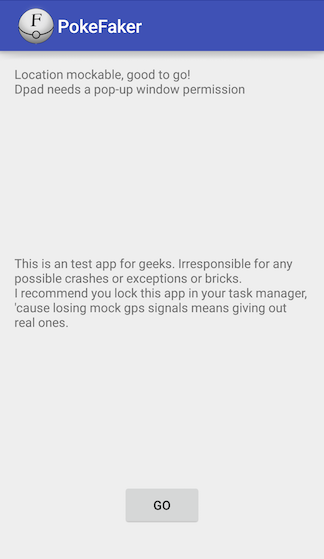
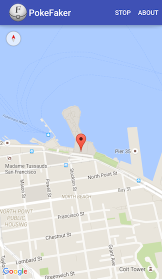
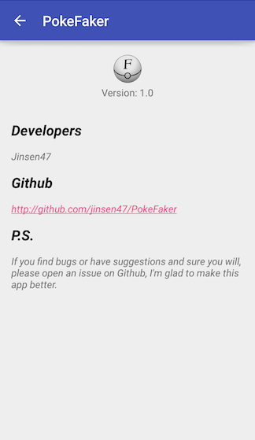

# PokeFaker
一个关于PokemonGo的Xposed插件

### [English version](README.md)

## DISCLAIMER
- 这是一个Xposed作弊插件, 任何作弊都有被发现的可能, 使用前请做好被封号的心理准备
- 对任何可能造成的封号, **不负责**
- 对任何异常情况造成的数据丢失, 或变砖等等, **不负责**
- 如果对以上声明任何一条不同意, 请Ctrl+W(Cmd+W)离开

## DOWNLOAD
[Fir](http://fir.im/z7vm)

## HOW TO USE
- 需要Xposed框架和Xposed框架管理器
- 需要科学上网
- 下载并安装应用
- 重启手机, 打开权限管理(安全中心等等), 在应用权限设置中允许**悬浮窗**权限
- 打开应用, 选个你喜欢的地方
- 打开PokemonGo, 起飞~

## FEATURES
- 提供了一个简单的方向选择器, 单击分别向四个方向移动固定的距离
- GPS开关要打开, 但是实际并不会调起系统GPS
- 使用Google地图选择地点, 世界任你遨游
- 完全合法, 没有反编译或替换他们一个字节

## SCREENSHOT

## HELP IN NEED
- 我用PS自己搞了个图标, 但是并不是很满意, 有想法的同学欢迎联系我
- 个人开发者, 欢迎打赏一杯咖啡钱~

## IN THE FUTURE
- 屏幕方向键太难用, 准备换成屏幕摇杆
- 点击方向键, 反应太慢, 准备着手解决, 但是目前并没有什么想法
